## Let vs Var

ES6 introduced _let_ variables and _block scoping_. Because new versions of JavaScript needs to remain backwards-compatible, the couldn't change the behavior of _var_ variables.  The result is that _let_ variables behave very differently than _var_'s when enclosed by curly braces. 

_Let_ variables will be confined to the braces where they were created: _block scoping_.

_Var_ variables are hoisted outside of almost any curly braces they are in (except functions): _lexical scoping_. {more on this in the next chapter}

The example below illustrates how _var_ & _let_ variables are treated differently by JavaScript whenever a new block is created.

___
 
### The Code

```js
let global_let = 'global let';
console.log('leaving global scope');
{
    console.log('entering block scope');
    var inner_var = 'global var';
    let inner_let = 'inner let';
    console.log('leaving block scope');
};
console.log('re-entering global scope');
inner_var = 'modified globally';
console.log('final state');
```
__Let__'s temporal dead zone. (from step 3):
* [2ality](https://dmitripavlutin.com/variables-lifecycle-and-why-let-is-not-hoisted/)
* [FreeCodeCamp](https://medium.freecodecamp.org/what-is-variable-hoisting-differentiating-between-var-let-and-const-in-es6-f1a70bb43d)

[PythonTutor link](https://goo.gl/TMzZRs)

[Parsons Practice](hhttps://elewa-academy.github.io/parsons/examples-to-study/scope-and-control-flow.html#let-vs-var)

___

### The Sketches

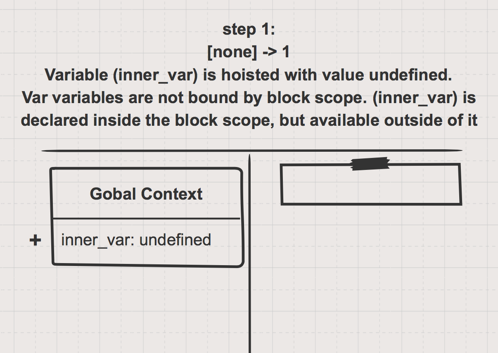
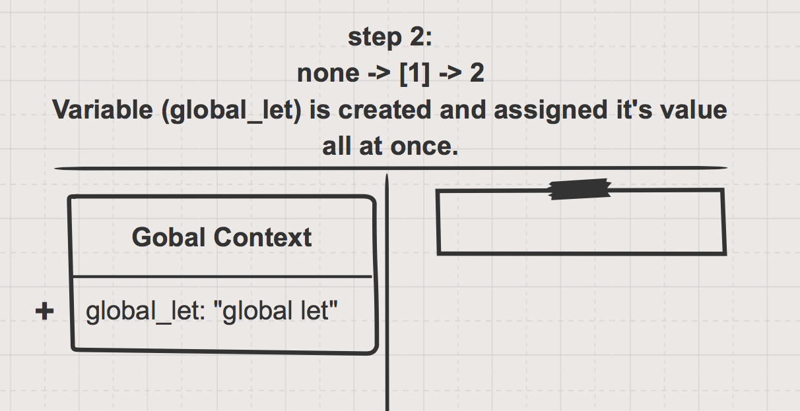
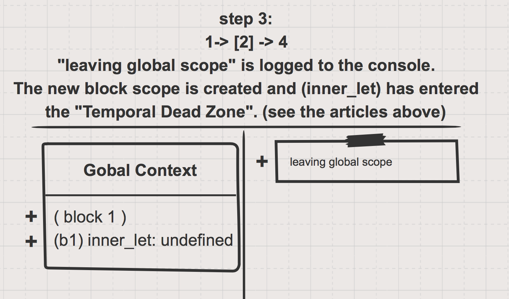
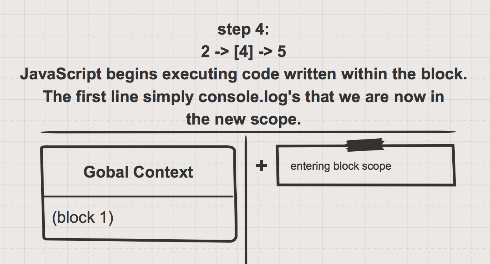
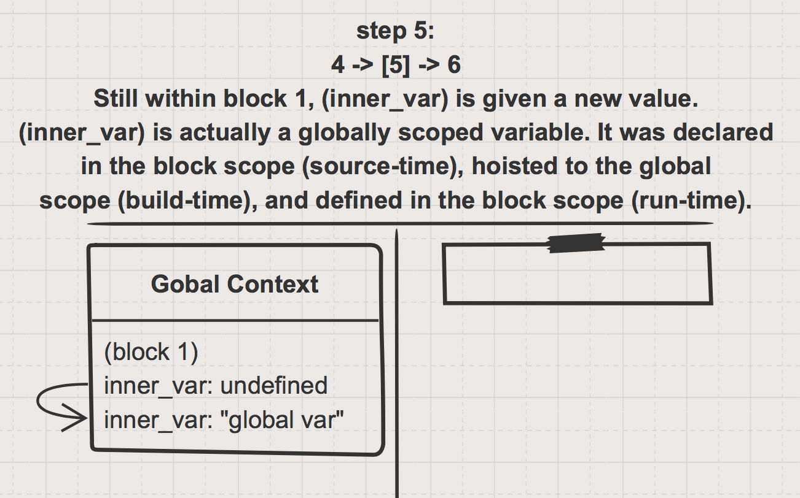
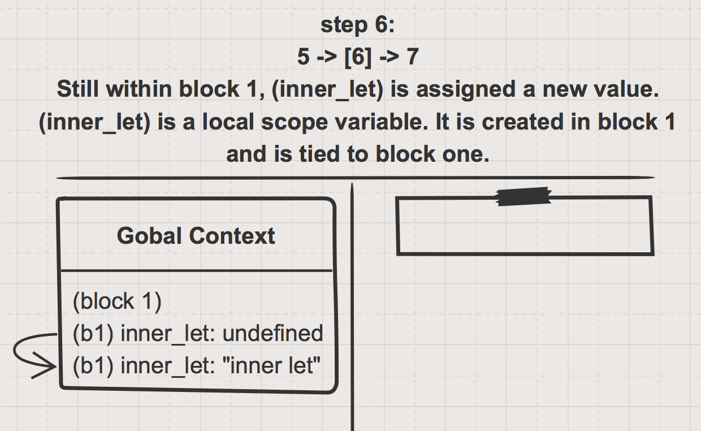
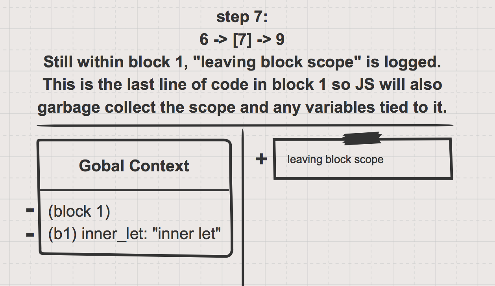
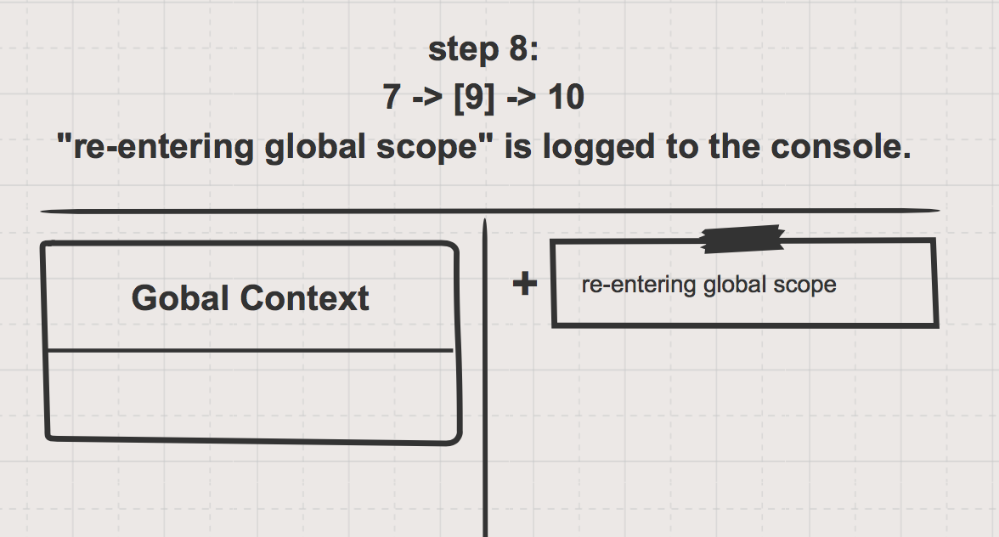
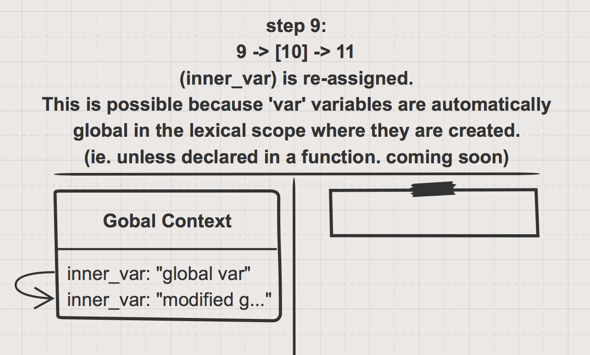
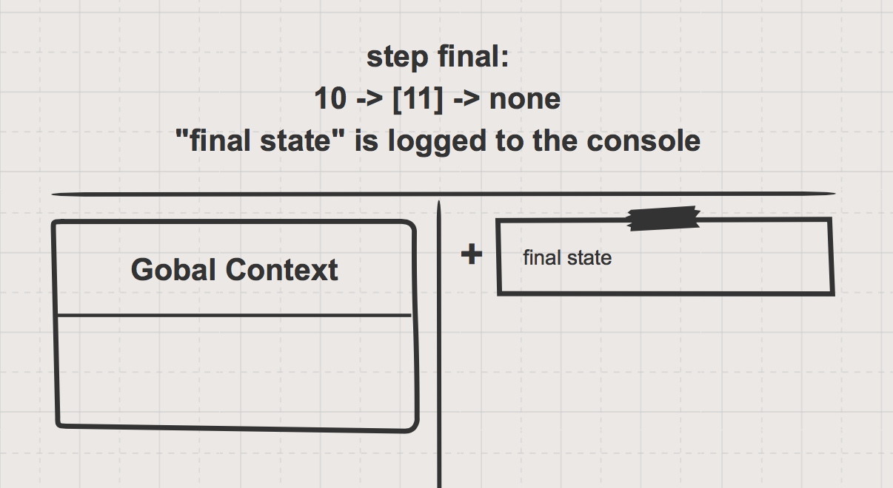

___

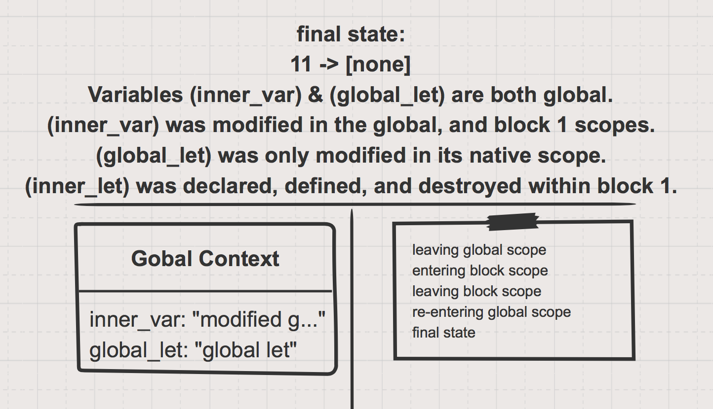

___
___
### <a href="http://janke-learning.org" target="_blank"></img> Janke Learning</a>
